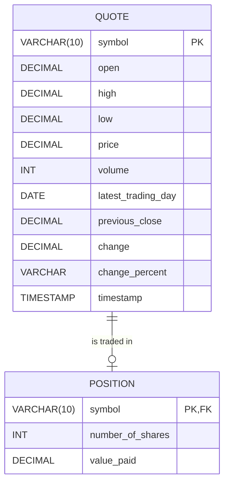

# Stock Quote App

## Introduction
The Stock Quote Application is a Java-based command-line tool designed to simulate a real-time stock trading environment. It allows users to manage a personal portfolio by fetching live stock data from the Alpha Vantage API and executing buy or sell orders. The application persists transaction history and portfolio status using a PostgreSQL database.

This project demonstrates a robust full-stack implementation using Core Java. Key technologies and tools include **Maven** for dependency management, **OkHttp** for REST API consumption, **Jackson** for JSON parsing, and **JDBC** for connecting to the **PostgreSQL** database. The application is containerized using **Docker** to ensure consistent deployment across different environments.

## Quick Start
How to use your apps?
## Option 1:
1. Clone the repository:
```bash
git clone <repo-url>  # git clone https://github.com/jarviscanada/jarvis_data_eng_KaiqiangZheng
cd core_java/stockquote
```
2. Compile and Build Application
```bash
mvn clean package # = mvn clean compile package
```
3. Run locally
```bash
java -jar target/stock_quote_app-1.0-SNAPSHOT.jar
```

## Option 2:
Run using Docker: 

We need a shared network to allow the application and database to communicate.

```bash
docker network create stock-net
```

Run the psql_docker.sh script under scripts folder to create psql database. 

Add it to stock-net.

```bash
docker network connect stock-net jrvs-pgjdbc
```

Prepare configuration file "docker_properties.txt" in your current directory.

```properties
# Database Config (According to your configuration) e.g.
db-class=org.postgresql.Driver
server=jrvs-pgjdbc
database=stock_quote
port=5432
username=postgres
password=password

# Alpha Vantage Config (REAL_API_KEY_HERE)
api-key=your_api_token
```

Once the network, database, and config file are ready, run the image:

``` bash
docker run --rm \
  --network stock-net \
  -v $(pwd)/docker_properties.txt:/app/properties.txt \ 
  -v $(pwd)/logs:/app/logs \
  -it \
  kaiqiangzheng15/stock-quote:1.0  #docker_user_name = kaiqiangzheng15
```


## Implementation

### ER Diagram
The following diagram illustrates the relationship between the database entities. The `position` table has a foreign key constraint on the `quote` table, ensuring that a user can only hold positions for stocks that have valid market data stored in the system.



### Design Patterns
This project heavily utilizes the **Data Access Object (DAO)** pattern to separate the application's business logic from the persistence layer.

The core of this implementation is the generic **CrudDao** interface, which defines standard operations such as `save`, `findById`, and `deleteById`. Concrete implementations, specifically **QuoteDao** and **PositionDao**, implement this interface and handle the low-level SQL execution using **JDBC**.

This design provides a clear abstraction:
- The **Service layer** (e.g., `QuoteService`) interacts with Java objects and the **DAO interface**, completely unaware of the underlying SQL syntax or database connection details.

This separation of concerns adheres to the **Single Responsibility Principle (SRP)**. It makes the application highly maintainable¡ªif we were to switch from PostgreSQL to MySQL, we would only need to update the DAO implementation without touching the business logic.

Furthermore, this pattern significantly enhances **testability**. By using **Dependency Injection**, we can easily inject mock DAO objects into our Services during unit testing, allowing us to verify business rules (like checking stock availability) without requiring a running database instance.

## Test

The application was tested using a combination of Unit Testing and Integration Testing to ensure robustness across all layers.

### Unit Testing (JUnit 5 & Mockito)

These tests focused on the Service layer. We used Mockito to mock external dependencies like `QuoteDao` and `QuoteHttpHelper`. This allowed us to isolate business logic (e.g., ensuring a user cannot buy more shares than the available volume) without making actual network calls to Alpha Vantage or connecting to the database.

### Integration Testing (JUnit 5 & JDBC)

These tests verified the actual data flow between the Java application and the PostgreSQL database.

- **Database Setup**: A local Dockerized PostgreSQL instance was used.
- **Test Lifecycle**: We utilized `@BeforeEach` and `@AfterEach` annotations to manage the test environment. Before every test, the database tables were cleaned (truncated) to ensure a known state.
- **Verification**: Test data was inserted using the DAO, methods were executed, and the results were verified by querying the database again to ensure:
    - The data was correctly **persisted**, **updated**, or **deleted** (CRUD operations).
    - Foreign key constraints were **respected**.