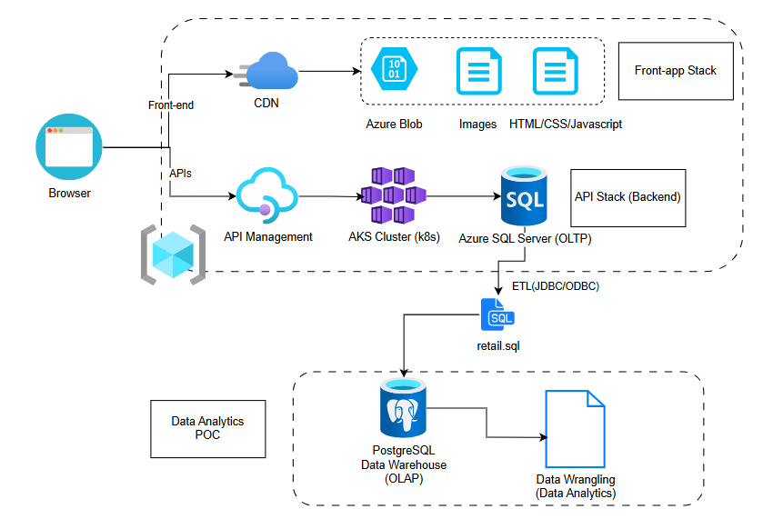

# Introduction
This project analyzes retail transaction data to better understand customer purchasing behaviors and support data-driven decision making for LGS.  
Using customer purchase history, we identify value segments such as loyal customers, new customers, and high-value champions.  
These insights enable LGS to develop targeted promotional strategies, retention campaigns, and personalized engagement activities that improve customer lifetime value and ultimately revenue.

The analytic results are intended to be consumed by LGS business stakeholders and potentially operationalized within their web application to drive automated marketing recommendations ¡ª such as loyalty offers, churn alerts, or personalized product campaigns.

The work was completed using Jupyter Notebook running on a Docker container, Python, and industry-standard data analytics libraries including pandas, matplotlib and seaborn. Techniques used include data wrangling, exploratory analysis, RFM scoring, segmentation, and visualization.

# Implementaion
## Project Architecture
The architecture consists of:

- **Retail transaction database** (provided as raw files)
- **Analytics layer** implemented via a Jupyter notebook for data preparation, modeling, and insights generation
- **Output insights** including customer segmentation and analytical recommendations
- **LGS Web Application**, which could consume the results and present actionable dashboards and targeted marketing strategies to business users

## Data Analytics and Wrangling
?? Notebook link: [Found Script Here](./python_data_wrangling/retail_data_analytics_wrangling.ipynb)

Customer transaction data was cleaned, aggregated, and transformed to extract business insights.  
We performed RFM (Recency, Frequency, Monetary) analysis to group customers by value, enabling actions such as:

- Rewarding loyal high-value segments
- Offering incentives to at-risk or about-to-churn customers
- Engaging promising customers to convert them into loyal buyers
- Designing tailored campaigns based on purchasing behavior

# Improvements
- List three improvements that you want to do if you got more time
  
1. **Automated ETL pipeline** ¡ª schedule weekly refreshes to update segmentation dynamically.
2. **Dashboard integration** ¡ª visualize insights in Power BI/Tableau or inside the LGS web app.
3. **Predictive modeling** ¡ª extend RFM into churn prediction or lifetime value forecasting using machine learning.
