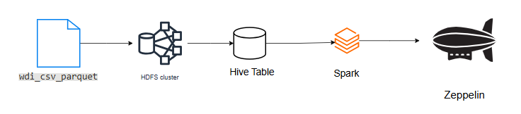

# Spark/Scala Project
## Introduction
### Business Context
The London Gift Shop (LGS) has successfully utilized data analytics to improve marketing campaign effectiveness and customer retention. However, as the company expands, the volume of transactional data has grown exponentially. The previous analytics solution, built on a single-node architecture (local Jupyter Notebook with Pandas), is no longer capable of processing this data volume efficiently and faces performance bottlenecks.

To address this, LGS is migrating its data infrastructure to a distributed computing model. This project serves as a Proof of Concept (PoC) to re-architect the data solution using Apache Spark. The goal is to enable scalable big data processing and to evaluate two distinct cloud-based Spark environments¡ªDatabricks on Azure and Zeppelin on Hadoop (GCP)¡ªto determine the best fit for the company's long-term data strategy.

### Technologies & Frameworks

This project leverages the following technologies to build a robust big data pipeline:
Apache Spark (PySpark): The core distributed computing engine used for large-scale data processing.
Databricks (Azure): A unified data analytics platform used for the retail data implementation.
Apache Zeppelin (GCP Dataproc): A web-based notebook used for the Hadoop implementation.
Hadoop HDFS & Hive: Used for distributed storage and metadata management within the GCP environment.
Azure DBFS: Databricks File System used for storage on Azure.
Parquet & CSV: Data formats used for ingestion and storage.

## Databricks and Hadoop Implementation
### Dataset & Analytics
Dataset: Online Retail II Data
The analysis focuses on transactional retail data containing invoices, stock codes, customer IDs, and sales figures.
### Analytics Performed:
The original Pandas logic was refactored into PySpark to perform the following:
 - Data Wrangling: Cleaning data, handling missing values, casting types, and identifying outliers in invoice amounts.
 - Sales Performance: Calculating monthly sales growth and identifying cancellations vs. valid orders.
 - Customer Insights: Analyzing Monthly Active Users (MAU) and distinguishing between New vs. Existing user cohorts.
 - RFM Segmentation: A complex implementation of Recency, Frequency, and Monetary value analysis to categorize customers into segments (e.g., "Champions", "At Risk") for targeted marketing.

Notebook Link: Retail Data Analytics with PySpark [Found Script Here](./notebook/Retail%20Data%20Analytics%20with%20PySpark.ipynb)
### Architecture
The solution is deployed on Microsoft Azure using Databricks.
 - Data Ingestion: Raw CSV data is uploaded to DBFS (Databricks File System).
 - Processing: A Spark Cluster (managed by Databricks) reads the raw data.
 - Transformation: PySpark is used to transform the DataFrames (filtering, aggregating, window functions).
 - Presentation: Results are visualized directly within the Databricks Notebook environment.
### Architecture Diagram

## Zeppelin and Hadoop Implementation
### Dataset & Analytics
 - Dataset: World Development Indicators (WDI)

The analysis utilizes the WDI dataset, provided in Parquet format, which contains global development metrics such as GDP, CO2 emissions, and population data.
### Analytics Performed:
 - Hive Integration: Created external Hive tables (wdi_csv_parquet) mapping to data stored in HDFS.
 - Spark SQL: Utilized Spark SQL within Zeppelin to query the Hive metastore.
 - Data Exploration: Performed aggregation and trend analysis on global economic and environmental indicators.
 - Notebook Link: WDI Data Analytics (Zeppelin) [Found Script Here](./notebook/Spark%20Dataframe%20-%20WDI%20Data%20Analytics_2MCCWRC7Q.zpln)
### Architecture
The solution is deployed on Google Cloud Platform (GCP) using Cloud Dataproc.
 - Storage: WDI Parquet files are stored in HDFS (Hadoop Distributed File System).
 - Metadata: A Hive Metastore manages the schema definitions for the wdi_csv_parquet table.
 - Interface: Apache Zeppelin runs on the master node, communicating with the Spark engine.
 - Execution: Spark jobs run across the Hadoop worker nodes to process queries.
### Architecture Diagram

## Future Improvement
To further harden this production pipeline and increase business value, the following improvements are recommended:
 - Implement Delta Lake:
Currently, the Databricks solution writes data as standard Tables/CSV. Migrating to Delta Lake would provide ACID transactions, scalable metadata handling, and time-travel capabilities (version history) for the retail data.
 - Orchestration with Airflow or Azure Data Factory:
The current notebooks are run manually. Integrating an orchestration tool like Apache Airflow or Azure Data Factory would allow the ETL pipelines to run on a scheduled basis (e.g., nightly) and handle dependencies and retries automatically.
 - Dashboard Integration:
While Notebooks are great for data engineering, business users prefer dashboards. Connecting the processed Spark tables to BI tools like Tableau or Power BI (via JDBC/ODBC) would enable dynamic, self-service reporting for the marketing team.